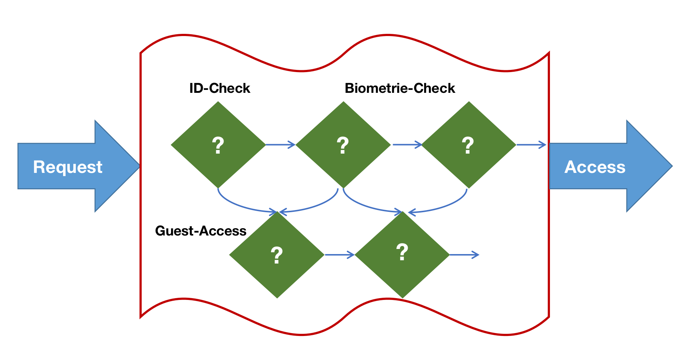

# 🔗 Chain of Responsibility 

## Introduction
The Chain of Responsibility pattern is a behavioral design pattern that facilitates the passing of requests through a sequence of handlers. When a request is received, each handler determines whether to handle the request or pass it to the next handler in the sequence.

##  🚨 The Problem
Imagine you are responsible for the security of a high-tech research facility. You need to implement a series of security checks to control access to various areas within the facility. 

Initially, you focus on the entrance to the facility. To gain access, individuals must first provide a valid ID card. If their card is invalid, there's no need to proceed with any other security checks.

Over time, you recognize the need for additional security measures. You implement a step to verify biometric data, such as fingerprint or retina scans, as a second check after the ID card validation to ensure the person matches the identity on the card.

To enhance security further, you introduce a check to monitor unusual behavior. This means that if someone repeatedly attempts to access restricted areas without authorization, an alarm is triggered, and security personnel are notified.

Additionally, you implement a caching mechanism that stores the access history of individuals. If a person with a valid ID and matching biometric data has recently accessed a particular area, the system can use this cached information to expedite access, saving time and resources.

As you continue adding these security checks, the codebase for your access control system becomes increasingly complex and intertwined. Modifying one check sometimes has unintended consequences on others, making the system challenging to maintain. When you attempt to apply these checks to other facilities or research projects, you find that each one requires a slightly different combination of checks, leading to code duplication and inconsistencies.

Ultimately, the security system becomes difficult to manage, and you decide to undertake a comprehensive refactoring effort to simplify and standardize the security checks, ensuring the efficient and secure access control throughout the organization.

## ✔️ The Solution
Like many other behavioral design patterns, the Chain of Responsibility pattern involves encapsulating specific checks as standalone objects, referred to as handlers. In our example, each security check should be extracted into its own class, housing a singular method responsible for performing the check. The request, along with its relevant data, is supplied as an argument to this method.

The essence of this pattern lies in connecting these handlers into a linked chain. Each linked handler maintains a reference to the next handler in the chain. Beyond their primary responsibility of processing a request, handlers also facilitate the transfer of the request along the chain. This continues until all handlers within the chain have had an opportunity to process the request.

What's particularly advantageous is that a handler possesses the autonomy to decide whether or not to pass the request further down the chain, effectively halting any subsequent processing.

In the context of our example concerning the security of a research facility, a handler executes its specific security check and then makes the determination of whether to forward the request to the next handler in the chain. Assuming the request satisfies the criteria, all the handlers can carry out their respective security measures, be it ID validation, biometric scans, behavior monitoring, or caching.
## Structural Elements

- **Handler**:  The Handler defines a standardized interface shared among all concrete handlers. Typically, this interface encompasses a single method responsible for processing requests. Occasionally, it might additionally include a method for establishing the next handler within the chain.
- **Base Handler**: The Base Handler serves as an elective class designed to accommodate shared, boilerplate code among all handler classes. Typically, it includes a field for retaining a reference to the next handler. Clients can establish a chain by providing a handler as an argument to the constructor or setter of the preceding handler. This class may also implement default handling behavior, allowing it to pass the execution to the next handler while verifying its presence in the chain.
- **Client**: The Client possesses the flexibility to assemble chains either once during initialization or dynamically based on the application's logic. It's important to emphasize that a request can be directed to any handler within the chain, and it's not restricted to the initial handler in the sequence.
- **Concrete Handlers**: Concrete Handlers house the real implementation for request processing. When a handler receives a request, it must make a determination regarding whether to handle it and whether to forward it down the chain.
   Handlers are typically self-contained and remain unchanged once initialized. They are designed to receive all required data through their constructor, making them immutable during their lifecycle.
## Example
In the following example, we implement the Chain of Responsibility design pattern in Python to simulate a logging system. This pattern allows log messages to be processed and handled by different loggers based on their severity levels, with the flexibility to add or remove loggers dynamically.

The structure includes:

1. **Handler Interface**: The `Logger` class serves as the handler interface, defining the methods for processing log messages and linking to the next handler in the chain. Each logger has a designated severity level.

2. **Concrete Handlers**: Three concrete logger classes have been implemented - `ConsoleLogger`, `FileLogger`, and `EmailLogger`. Each logger is responsible for handling log messages based on its severity level. The `set_next_logger` method allows for chaining the loggers together.

3. **Client Code**: The client code creates instances of the concrete handlers and forms a chain by setting the next logger for each handler. Log messages are then sent through the chain using the `log_message` method. Each logger decides whether to process the message based on its severity level. This allows for dynamic and flexible handling of log messages by the appropriate loggers in the chain.

The example demonstrates how the Chain of Responsibility pattern helps decouple senders of requests (log messages) from receivers (loggers) and allows you to add or modify handling behavior without altering the client code.
## 💡 Applicability
The Chain of Responsibility pattern is ideal for situations where a program needs to process diverse types of requests in an unknown sequence. This pattern allows you to link multiple handlers into a chain, and when a request is received, it is passed through each handler in the chain to determine if it can be processed. It is useful when you need to execute handlers in a specific order, as you can arrange the handlers in the chain as required, ensuring that requests follow the planned sequence. Additionally, the Chain of Responsibility pattern is valuable when you anticipate changes in the set of handlers and their order at runtime. By providing setters for reference fields in the handler classes, you can dynamically insert, remove, or reorder handlers as needed, making it a flexible and adaptable design choice.