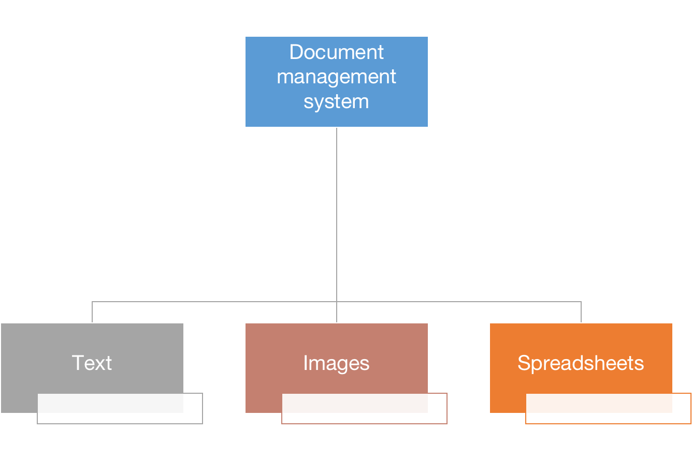

# 🕊️ Command
## Introduction
The Iterator pattern is a behavioral design pattern that defines a standardized way to traverse a collection of objects, decoupling the traversal algorithm from the collection's implementation. By doing so, it promotes a clean and flexible design that allows for the easy addition of new traversal algorithms without modifying the collection's structure.
##  🚨 The Problem
Imagine you are developing a Document Management System (DMS) to efficiently organize and manipulate a vast array of documents within an organization. The DMS, at its core, is a collection that holds various document types, ranging from text files and images to spreadsheets and presentations.

Initially, the DMS is designed to handle documents using a straightforward list-based storage structure. Users can easily retrieve documents by iterating through the list. However, as the DMS gains popularity and the volume and diversity of documents increase, the limitations of a simple list-based approach become apparent.

Imagine you are developing a Document Management System (DMS) to efficiently organize and manipulate a vast array of documents within an organization. The DMS, at its core, is a collection that holds various document types, ranging from text files and images to spreadsheets and presentations.

Initially, the DMS is designed to handle documents using a straightforward list-based storage structure. Users can easily retrieve documents by iterating through the list. However, as the DMS gains popularity and the volume and diversity of documents increase, the limitations of a simple list-based approach become apparent.

Now, consider the scenario where a new requirement emerges: users need the ability to traverse documents in a more sophisticated manner. Perhaps there is a need for filtering documents based on metadata, searching for specific keywords, or organizing documents in a hierarchical structure to reflect project dependencies.

Without the Iterator design pattern, accommodating these diverse traversal requirements within the DMS becomes challenging. If you were to directly integrate various traversal methods (e.g., filtering, searching, hierarchical navigation) into the core DMS code, the primary responsibility of efficiently managing and storing documents becomes obscured by an increasingly complex traversal logic.

Moreover, your clients, which may include different departments within the organization or external applications interacting with the DMS, might not be concerned with how the documents are stored internally. They just want a seamless way to access and manipulate documents.

## ✔️ The Solution
In the context of a DMS, the main idea of the Iterator pattern is to extract the traversal behavior into a separate object, appropriately named an iterator. This iterator not only implements the traversal algorithm but also encapsulates all the traversal details, such as the current position within the document collection and how many documents are left to iterate through.

By doing so, the DMS can have multiple iterators simultaneously traversing the document collection independently of each other. This independence is crucial, especially when dealing with diverse traversal requirements, such as filtering, searching, or navigating hierarchical structures.

Each iterator provides a standard method for fetching documents from the collection. The client code can invoke this method until it returns nothing, indicating that the iterator has successfully traversed all the documents. This standardized interface ensures compatibility between the client code and any collection type or traversal algorithm, as long as the appropriate iterator is employed.

The real power of the Iterator pattern becomes evident when considering the adaptability it offers to the DMS. If a specific traversal method is needed—for example, filtering documents based on metadata or searching for specific keywords—you can simply create a new iterator class tailored to that requirement. This can be achieved without altering the core DMS or affecting the client code.
## Example
# Enhancing Reading Experience with Iterator Design Pattern

Imagine you are an avid reader with an extensive personal library at home, filled with books of various genres and subjects. You decide to spend your weekend exploring your collection and revisiting some of your favorite literary works.

Without a systematic approach, you might find yourself aimlessly wandering through the shelves, searching for specific books or getting lost in the vast array of titles. The lack of organization could lead to frustration, and you might miss out on the joy of rediscovering hidden gems in your collection.

## Iterator Design Pattern in Action

Now, consider the Iterator design pattern as a solution to enhance your reading experience. You decide to implement a virtual bookshelf app that acts as a guide for navigating your personal library. This app offers different iterators to facilitate exploration:

### 1. Random Selection Iterator (No Guide):
   - Without any guidance, you might randomly pick books based on intuition or whim.
   - However, this approach can be inefficient, and you might overlook certain books or spend too much time searching for a specific title.

### 2. Alphabetical Navigator (Smartphone Navigator):
   - Alternatively, you can use an alphabetical iterator to navigate through your books systematically.
   - This iterator helps you locate books more efficiently, but it lacks the personal touch and may not consider your specific reading preferences or mood.

### 3. Genre-Specific Guide (Human Guide):
   - Another option is to hire a literature enthusiast who knows your collection intimately and can guide you based on your interests.
   - This personalized guide iterator tailors the exploration to your liking, providing insights, recommendations, and exciting stories related to each book.

In this scenario, your personal library represents a vast collection of literary works, and the iterators (random selection, alphabetical navigation, and genre-specific guidance) showcase the versatility of the Iterator design pattern. This pattern ensures a systematic and tailored approach to exploring your book collection, catering to different preferences and optimizing your reading experience.

## 💡 Applicability
The Iterator pattern is an excellent choice when you need to traverse a collection of objects in a specific order, but you don't want to expose the underlying representation of that collection. This pattern is also useful when you want to provide multiple traversal algorithms for the same collection, as it allows you to decouple the traversal logic from the collection's implementation. Finally, the Iterator pattern is valuable when you need to provide a uniform interface for traversing different collections, as it allows you to treat all collections as a generic sequence of elements.

In addition, The iterator encapsulates the intricacies of interacting with a intricate data structure, furnishing the client with a set of straightforward methods to access the elements within the collection. While this methodology offers great convenience for the client, it simultaneously shields the collection from inadvertent or malicious actions that the client could potentially execute if directly manipulating the collection.

