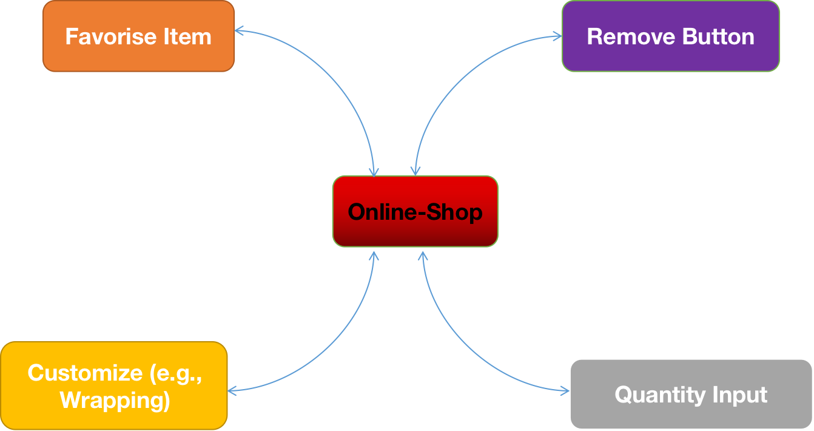

# 🚦 Mediator
## Introduction
The Mediator pattern is a behavioral design pattern that promotes loose coupling by encapsulating the way disparate sets of objects interact and communicate with each other. It restricts direct communications between the objects and forces them to collaborate only via a mediator object.
##  🚨 The Problem

In a similar scenario, consider an e-commerce application with a shopping cart feature. The cart interface includes various elements such as product items, a quantity input field, a "Remove" button, and a "Checkout" button. Some products may have optional customization features, like gift wrapping, which, when selected, should dynamically update the total price.

Without the Mediator pattern, the customization logic might be tightly integrated into the product item and quantity input classes. If a user selects gift wrapping, the quantity input might need to be disabled or the "Remove" button hidden. This coupling makes it challenging to reuse these components in other parts of the application where customization might not be applicable.

## ✔️ The Solution
By implementing the Mediator pattern, a central mediator object could manage the communication between the product items, quantity input, and customization features. For example, selecting gift wrapping triggers a notification to the mediator, which then updates the necessary components accordingly. This way, each component remains focused on its specific functionality, and the Mediator pattern ensures a clean separation of concerns, making these components more reusable in different contexts within the application.

The Mediator pattern proves invaluable in addressing the shopping cart scenario by acting as a central orchestrator for communication between diverse components like product items, quantity inputs, and customization features. It decouples these components, preventing tight interdependencies, and encapsulates interaction logic within the Mediator itself. This fosters modular and reusable components, as each element remains focused on its specific functionality while relying on the Mediator to manage dynamic updates and facilitate consistent communication. With a clear separation of concerns, the Mediator pattern not only enhances scalability and maintainability but also provides a standardized interface for components, making the system more adaptable to changes and new features without the need for extensive modifications to existing classes.
## Components
1. **Mediator**: Defines an interface for communicating with Colleague objects and maintains references to Colleague objects.
2. **Colleague**: Defines an interface for communicating with Mediator objects and maintains a reference to a Mediator object.
3. **Concrete Mediator**: Implements the Mediator interface and coordinates communication between Colleague objects.
4. **Concrete Colleague**: Implements the Colleague interface and communicates with other Colleague objects through its Mediator.
5. **Client**: Creates Concrete Mediator and Concrete Colleague objects and registers Colleague objects with the Mediator.
## 💡 Applicability
Identify a cluster of closely connected classes that could benefit from increased independence for improved maintenance and greater flexibility in reuse. Establish a mediator interface defining the communication protocol between mediators and various components, simplifying the interchangeability of components in diverse contexts. The interface becomes crucial for facilitating the integration of component classes into different scenarios, fostering adaptability. Create a concrete mediator class that manages references to all components, enabling method calls to any component from within the mediator. Optionally, enhance the mediator to handle component creation and destruction, resembling a factory or a facade. Components, in turn, maintain a reference to the mediator, typically established during their construction. Modify component code to invoke the mediator's notification method instead of directly interacting with other components, consolidating the mediation logic within the mediator class and executing relevant actions upon receiving notifications.