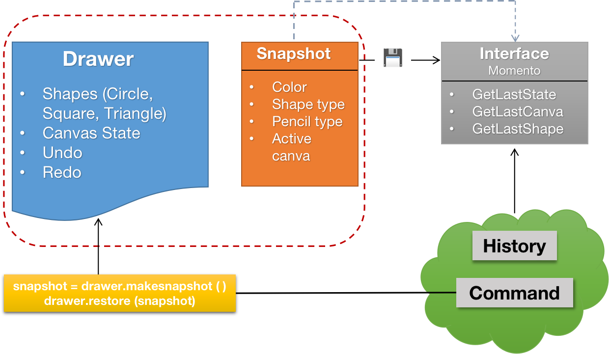

# ⏪ Memento

## Introduction

The Memento pattern is a behavioral design pattern that allows the capturing and externalizing of an object's internal
state without violating encapsulation. This pattern enables the restoration of an object to a previous state, providing
a mechanism for undoing or rolling back to a previous state.

## 🚨 The Problem

Imagine you are developing a drawing application, and users can create and manipulate various shapes on a canvas. You
want to implement an undo feature to revert the last operation, such as adding, moving, or resizing a shape.
Without the Momento pattern, you might be tempted to implement the undo feature by storing the state of the canvas in a
stack. Each time a user performs an operation, you would push the current state of the canvas onto the stack. When the
user clicks the undo button, you would pop the last state from the stack and restore the canvas to that state.
This approach, however, has several drawbacks. First, it requires you to store the entire state of the canvas, which can
be expensive. Second, it violates the principle of encapsulation, as the state of the canvas is stored outside the
canvas object. Finally, it is not scalable, as you would need to implement a separate undo feature for each type of
shape.

## ✔️ The Solution

The Memento design pattern addresses the challenge of implementing undo functionality in software applications by
providing a structured and encapsulated way to capture and restore an object's state. In scenarios where direct
approaches to saving and restoring the entire state of an object prove impractical due to encapsulation or complex data
structures, the Memento pattern offers an elegant solution.

Instead of exposing internal details or relying on extensive copying of object states, the Memento pattern introduces a
separate Memento class. This class is responsible for storing a snapshot of the object's state in a way that is specific
to the object being managed. The originator class, representing the object of interest, collaborates with the Memento
class to create and restore states.

By abstracting the state-saving logic into Memento classes, the pattern allows objects to encapsulate their internal
details while still providing a mechanism to capture and revert to previous states. This separation enhances the
flexibility and maintainability of the codebase, making it easier to manage undo functionality across various objects or
scenarios without exposing unnecessary complexities to the client code. Ultimately, the Memento pattern promotes a more
modular and extensible approach to implementing undo features in software applications.

## Components

1. **Originator**: The Originator class represents the object of interest, which is capable of saving and restoring its
   state. The class maintains a reference to a Memento object, which stores the state of the Originator. The Originator
   can create a Memento object to save its current state and restore its state from a Memento object.
2. **Momento**: The Memento class stores the state of the Originator object. The class is typically immutable,
   preventing the Originator from modifying its state. The Originator can only access the state stored in the Memento.
3. **CareTaker**: The CareTaker class is responsible for managing Memento objects. The class maintains a stack of
   Memento objects, allowing the Originator to save and restore its state. The CareTaker class is not aware of the
   internal details of the Originator or the Memento.
4. **Client**: The Client class creates an Originator object and performs operations on it. The Client can request the
   Originator to save its state by creating a Memento object. The Client can also request the Originator to restore its
   state by providing a Memento object.

## 💡 Applicability

The Memento pattern is applicable in scenarios where there is a need to capture and externalize the internal state of an
object without violating encapsulation. This pattern is particularly useful in implementing undo functionality in
software applications.

Apply the pattern in cases where accessing an object's fields, getters, or setters directly would compromise its
encapsulation.

When implementing an "undo" feature, the integration of Command and Memento patterns is beneficial. Commands handle
diverse operations on a target object, and concurrently, mementos capture and store the object's state right before a
command is executed.

When aiming to capture the current iteration state and facilitate potential rollbacks, consider employing Memento in
conjunction with Iterator. Mementos play a role in preserving the state of the iteration, allowing for the restoration
of the iteration to a previous state when needed.
