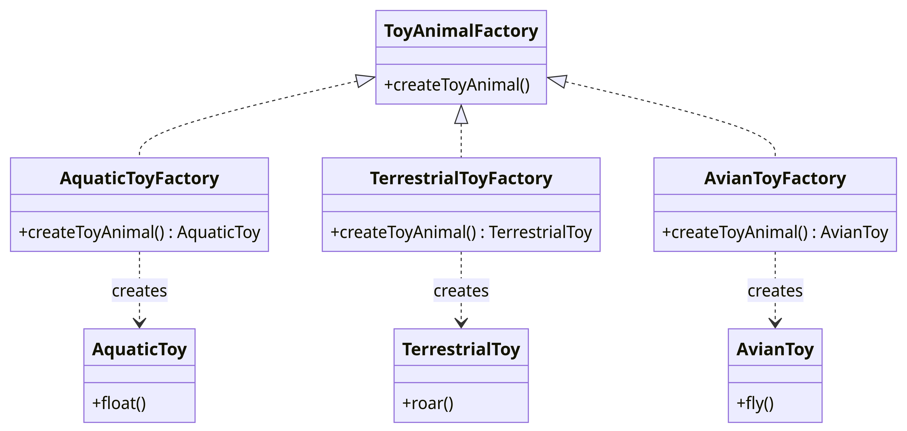

# ⚙️ Abstract Factory Design Pattern

## Introduction

The Abstract Factory is a creational design pattern that allows the creation of families of related objects without specifying their concrete classes.

##  🚨 The Problem

In a manufacturing ecosystem, you might have families of related products, like Cars, Bikes, and Trucks, and variants of these families (Electric, Gasoline, Hybrid). The challenge is creating individual vehicle objects that match others of the same family, without having to modify existing code when adding new products or families of products.

## ✔️ The Solution

The Abstract Factory pattern suggests declaring interfaces for each distinct product of the product family (cars, bikes, trucks, etc.). Variants of products adhere to these interfaces. Following that, the Abstract Factory—an interface with a list of creation methods for all products that are part of the product family—is declared.
For each product family variant, a separate factory class based on the AbstractFactory interface is created. For example, ElectricVehicleFactory can create ElectricCar, ElectricBike, and ElectricTruck objects.
## Structural Elements

- **Abstract Products**:  These declare interfaces for a set of related products that make up a product family (like Cars, Bikes, and Trucks).
- **Concrete Products**: These are implementations of abstract products, grouped by variants (like ElectricCar, GasolineBike, HybridTruck, etc.).
- **Abstract Factory**: This interface declares a set of methods for creating each of the abstract products.
- **Concrete Factories**: These implement creation methods of the abstract factory. Each concrete factory corresponds to a specific variant of products (like ElectricVehicleFactory, GasolineVehicleFactory, HybridVehicleFactory) and creates only those product variants.

The client code works with both factories and products via their respective abstract interfaces, which allows changing the type of factory and product variant without breaking the client code.
## Example

An application of the Abstract Factory pattern could be the creation of various animal toys in a toy factory. Concrete factories correspond to specific animal types (like aquatic, terrestrial, or avian) and create toy animals that match the category. Upon receiving an order, the toy factory checks the type of the requested animal category and uses this information to create a factory object from a class that matches the animal category. The rest of the code then uses this factory to create toy animals, thus ensuring that the wrong toys are not created.

The Abstract Factory design pattern provides an efficient way to create families of related objects, thus enhancing code modularity and making it more flexible and maintainable. For instance, if we decide to introduce a new category of animal toys (e.g., dinosaurs), we can do so without having to modify the existing animal categories, resulting in minimal disruption to the rest of the system.

## 💡 Applicability

🚀 Use the Abstract Factory Method when you don’t know beforehand the exact types and dependencies of the objects your code should work with.

The Abstract Factory Method separates product construction code from the code that actually uses the product. Therefore it’s easier to extend the product construction code independently from the rest of the code.
For example, to add a new type of toy animal to the toy factory, you’ll only need to create a new concrete factory subclass (like DinosaurToyFactory) and implement the abstract factory methods in it.
:rocket:
Use the Abstract Factory Method when you want to provide users of your library or framework with a way to extend its internal components.

🧠 Inheritance is probably the easiest way to extend the default behavior of a library or framework. But how would the framework recognize that your subclass should be used instead of a standard component?

The solution is to reduce the code that constructs components across the framework into a set of factory methods and let anyone override these methods in addition to extending the component itself.

🤓 Let’s see how that would work. Imagine that you have a toy factory application, and you want to create a new category of animal toys, dinosaur toys. You extend the standard ToyAnimal class with a new DinosaurToy subclass. But now you need to tell the main ToyShop class to use the new dinosaur toy subclass instead of the default ones.

To achieve this, you create a subclass DinosaurToyFactory from the base factory class and override its create_toy_animal method. While this method returns ToyAnimal objects in the base class, you make your subclass return DinosaurToy objects. Now use the DinosaurToyFactory class instead of the default factories. And that’s about it!

🎯 Implement the Abstract Factory pattern when your code needs to interact with different groups of related products, without relying on their specific classes. This is beneficial when these classes may not be predetermined, or when you wish to ensure the possibility for future scalability.