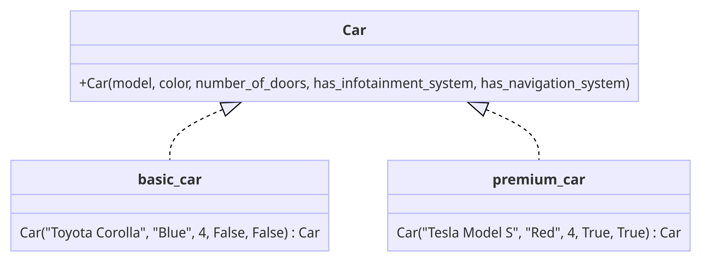

# 🏗️ Builder Design Pattern

## Introduction
The Builder design pattern is an object creation strategy that allows for the systematic assembly of intricate objects. Using a uniform set of construction procedures, it can create a range of object types and presentations. Furthermore, it provides a means to produce assorted variations of an object, successfully mitigating constructor overcrowding. This is particularly advantageous when the object has numerous possible versions or when its creation encompasses a multitude of steps.

##  🚨 The Problem
Consider an intricate object that necessitates meticulous, step-by-step establishment of multiple fields and nested objects. Typically, the code required for such initialization is hidden within a massive constructor filled with numerous parameters. In even more problematic scenarios, it may be dispersed throughout the client code.

As an example, consider the process of constructing a Car object. To build a basic car, you need to assemble the body, install the engine, set up the wheels, and add doors. But what if you want a more sophisticated car, with advanced features like a high-end audio system, leather seats, and sophisticated safety features?

One straightforward solution could be to extend the base Car class and develop a set of subclasses for each possible combination of features. However, this would eventually result in a large number of subclasses. Any new feature, like an advanced navigation system, would further expand this hierarchy.

An alternative method that doesn't involve creating numerous subclasses would be to introduce a comprehensive constructor within the base Car class, containing all possible parameters for the Car object. While this approach eliminates the need for subclasses, it introduces its own set of challenges.

In this example, let's extend our Car object scenario. To construct a car, you would need a multitude of parameters, many of which might not be used in a typical constructor call, leading to cluttered and confusing code. For instance, only a fraction of cars might have sunroofs or advanced infotainment systems, so the parameters related to these features will be pointless the majority of the time. This results in constructor calls that are needlessly complex and confusing, as parameters for rarely-used features are included by default.
## ✔️ The Solution

The Builder pattern recommends separating the object construction code from the base class, placing it in distinct objects known as builders.

The pattern structures object construction into a series of steps (like buildBody, installEngine, etc.). To create a Car object, you follow a sequence of these steps on a builder object. Crucially, it isn't necessary to execute all of the steps. You can choose only those steps relevant to producing a specific configuration of a Car object.

Some of the construction steps might necessitate different implementations when you need to create various versions of the Car. For instance, the body of a sports car may be built with lightweight composite materials, while an SUV's body would require more rugged, traditional materials.

In this scenario, you can design multiple builder classes that execute the same set of building steps but in different ways. You can then employ these builders in the construction process (i.e., an ordered set of calls to the building steps) to produce different types of Car objects.

Consider this in the realm of automobile manufacturing:

Picture a builder that employs standard-grade materials and components, crafting a fundamental, cost-effective vehicle. Another builder utilizes premium-grade materials and integrates high-tech features, creating a luxury car. A third one deploys superior materials, cutting-edge technology, and custom-crafted details, culminating in an elite, luxury sports car.

By adhering to the same assembly procedures, you receive a basic economy car from the first builder, a high-end sedan from the second, and a top-notch sports car from the third. However, this assembly workflow will only be effective if the client code that initiates the build sequence can engage with the builders through a unified interface. This enables diverse builders to fabricate different car models using the same building steps.

## 🚧 Structural Elements
- **Builder**: Concrete Builders offer distinct implementations of the assembly stages. These builders may fabricate vehicles that don't adhere to the standard interface.
- **Concrete Builder**: Vehicles are the final products. Vehicles built by different builders don't have to belong to the same class or interface. For instance, one builder might produce a compact car, while another constructs a luxury sedan.
- **Products**: Vehicles are the end products in this context. The vehicles created by various builders don't necessarily have to belong to the same class or interface. For instance, one builder may construct a family sedan, while another may be specialized in crafting high-performance sports cars.
- **Director**: The Director class establishes the sequence in which to execute assembly stages, allowing the creation and reuse of specific vehicle configurations.
- **Client**: The Client needs to link one of the builder objects with the director. Typically, this is accomplished once, via parameters in the director's constructor. Then the director utilizes that builder object for all subsequent assembly. Alternatively, the client can pass the builder object to the director's production method. In this case, a different builder can be used each time a vehicle is produced with the director.