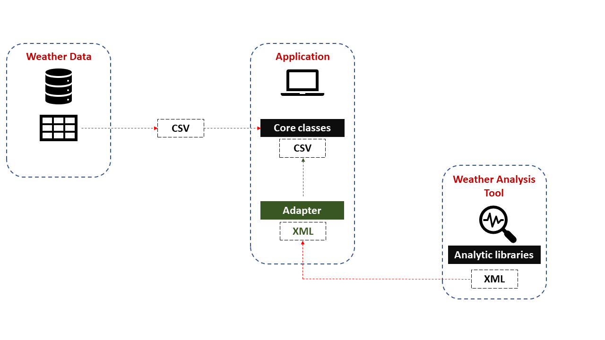

#  ⚙️️  Adapter Design Pattern

## Introduction

The Adapter serves as a structural design pattern that enables collaboration between objects that have mismatched interfaces.
## 🚨 The Problem
Imagine you're building a weather forecasting app that gathers meteorological data from various sources in CSV format to present accurate predictions to the user.

Later on, you decide to enhance the app by incorporating a third-party climate modeling algorithm. However, there's a limitation: this algorithm only accepts data in XML format. 

You could potentially modify the algorithm to accept CSV data, but this approach poses risks. First, it could disrupt other parts of your code that rely on the algorithm. Second, you may not even have access to the algorithm's source code, making such changes unfeasible.
## ✔️ The Solution
You can employ a bridge, a unique entity that modifies the interface of one component so it can seamlessly interact with another.

A bridge encapsulates one of the elements, concealing the intricate details of the data conversion that's going on under the hood. The encapsulated element remains oblivious to the existence of the bridge. For instance, you could encapsulate a device that operates using Bluetooth technology with a bridge that translates the data into Wi-Fi signals.

Bridges are not restricted to merely transforming data formats; they can also enable interaction between components with diverse interfaces. Here's the process:

1. The bridge adopts an interface that is compatible with one of the existing components.
2. Utilizing this interface, the existing component can safely invoke the methods of the bridge.
3. When the bridge receives an invocation, it forwards the request to the second component, albeit in the manner and sequence that the second component expects.

Occasionally, it may even be feasible to design a bidirectional bridge capable of translating calls in both directions.
Returning to our weather forecasting app example, to address the issue of mismatched formats, you could create CSV-to-XML bridges for each class within the climate modeling algorithm that directly interacts with your existing code. You would then modify your app to interact with the algorithm exclusively through these bridges. When a bridge gets a call, it converts the incoming CSV data into XML format and forwards the request to the relevant methods of the encapsulated climate modeling algorithm.
## 🚧 Structural Elements
The Singleton class includes a static method called 'getInstance,' which always returns the identical instance of the class it belongs to.

The constructor of the Singleton class should be inaccessible to external code. The 'getInstance' method should be the exclusive means for obtaining the Singleton object.

## Example
The operating system (OS) running on a computer can also exemplify the Singleton pattern. A computer typically runs a single instance of an operating system at any given time. Even if there are different processes and applications running simultaneously, they all interact with that one instance of the OS. The term "Operating System" in this context serves as a global point of access, allowing various software components to interact with system resources through a single, unique entity. Just like in a Singleton, this ensures that there's a coordinated, singular point for managing these resources.

## Implementation Guide
This approach employs the principle of object composition: the adapter conforms to the interface of one component while encapsulating the other. This design can be executed in most mainstream programming languages.
1. **Client**: The Client Class houses the existing operational logic of the software.
2.  **Client Interface**: The Client Interface sets forth a standard that other classes must adhere to in order to interact seamlessly with the client's code.
3. **Service**: The Service is a beneficial class, commonly third-party or legacy, that the client can't utilize directly due to an interface mismatch.
4.  **Adapter**: Acts as bridge class capable of interfacing with both the client and the service. It complies with the client interface while encapsulating the service object. The bridge takes calls from the client through its interface and translates these into a format the encapsulated service object can comprehend.
4. **Client**: The client's code remains decoupled from the specific bridge class as long as it interacts through the client interface. This flexibility allows for the integration of new kinds of bridges without disrupting existing client code. This becomes particularly useful if the service class interface undergoes changes or replacements: a new bridge class can be introduced without modifying the client code.

This design employs inheritance, allowing the adapter to inherit interfaces from both the client and the service simultaneously. It's worth noting that this method is only feasible in programming languages that support multiple inheritance, like C++.