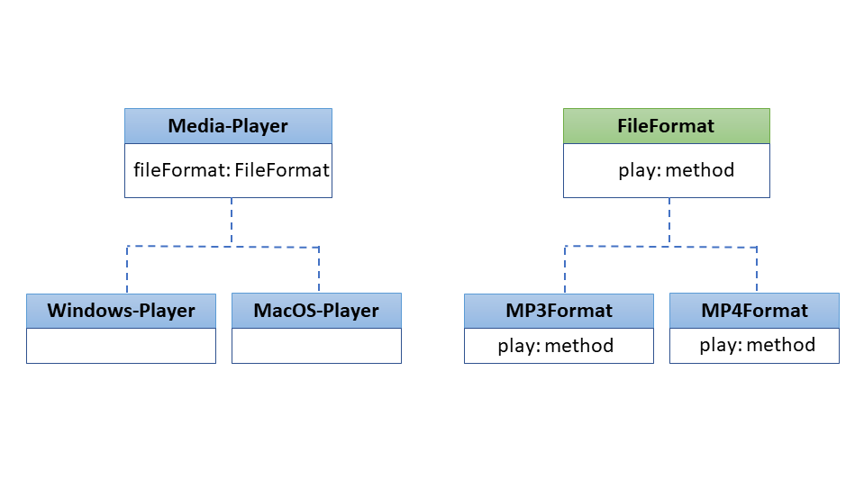

#  🌉️  Bridge Design Pattern

## Introduction

The Bridge design pattern allows you to divide a complex class, or a group of closely-linked classes, into two independent hierarchies: one for abstraction and another for implementation. This enables each hierarchy to be developed separately.

## 🚨 The Problem
The Bridge design pattern helps you manage the complexity that arises from having multiple dimensions of variation in a software system. For instance, consider a media player application that supports various formats (MP3, MP4, AVI) and different operating systems (Windows, macOS, Linux). Without the Bridge pattern, extending support for a new format would mean creating subclasses for each operating system and format combination, leading to a combinatorial explosion of classes.

Suppose initially the media player supports two formats (MP3, MP4) and two operating systems (Windows, macOS). That would require four classes. Now, if you decide to add support for a new operating system like Linux, you'd need to create two more classes, one for each format. Next, if you want to introduce a new format like AVI, you would need to add three more classes, one for each operating system. The number of classes grows quickly, making the system harder to maintain and extend.

By applying the Bridge pattern, you can separate the 'Format' hierarchy from the 'Operating System' hierarchy, enabling you to add a new format or a new operating system independently, without affecting the other hierarchy. This makes the system more modular, easier to understand, and simpler to extend.
## ✔️ The Solution
This complexity arises because we're trying to extend media player classes in two distinct aspects: by file format and by operating system. This is a frequent challenge when using class inheritance.

The Bridge design pattern addresses this issue by moving from inheritance to object composition. Essentially, this means separating one of the variables—say, file format—into its own class hierarchy. Then, the original Media Player class will hold a reference to an object from this new File Format hierarchy, rather than embedding all the characteristics and behaviors related to both file format and operating system within one class.

To implement this, we can separate the file format-related code into its own class hierarchy, complete with subclasses for MP3, MP4, and so on. The Media Player class will then have a reference field that points to one of these file format objects. This way, the Media Player can delegate any format-specific functions to the linked file format object. This reference serves as a "bridge" between the Media Player and File Format classes. Henceforth, adding new file formats or new operating systems can be done independently, without affecting the existing class structure for the other aspect.

## Example
In the realm of e-commerce platforms, the concept of abstraction can be seen in the user interface for both buyers and sellers, while the implementation could be the back-end services that handle tasks like inventory management, payment processing, and data storage. It's worth noting that by "abstraction" and "implementation," we're not referring to abstract classes or interfaces in programming languages but rather conceptual layers in an application's architecture.

Generally, an e-commerce platform could evolve along two independent lines:

1. Different user interfaces tailored for specific types of users—like individual buyers, wholesale customers, or administrators.
2. Support for multiple back-end services, possibly to integrate with various third-party tools or databases.

In the absence of a structured approach, this could lead to tangled code with myriad conditionals that link different UI types to various back-end services, making the system complex and hard to manage.

A more organized approach would involve isolating code pertaining to specific UI-service combinations into individual classes. However, this could soon inflate the number of classes, as adding a new UI type or a new back-end service would necessitate the creation of even more classes.

To address this, the Bridge pattern suggests separating these classes into two hierarchies:

1. Abstraction: Represents the user interface layer.
2. Implementation: Encompasses the back-end services that the platform uses.

In this design, an object from the abstraction layer (e.g., User Interface for buyers) holds a reference to an object in the implementation layer (e.g., Payment Processor). The abstraction object takes care of the platform's appearance and user interactions, while delegating the core functions to the linked implementation object. Since different implementations share a common interface, you can easily swap out one payment processor for another, for instance.

This results in a flexible structure, where changes in the user interface can be made independently of the back-end services, and vice versa. Adding a new back-end service, for example, would simply involve creating a new subclass in the implementation hierarchy, without the need to modify the UI classes.

## 🚧 Structural Elements

1. **Abstraction**: The Abstraction focuses on overseeing the higher-level operations, while delegating the detailed, low-level tasks to the implementation object.
2.  **Implementation**: The Implementation defines a unified interface that all specific implementations must adhere to. This ensures that an abstraction can interact with any implementation object using a consistent set of methods.

While the abstraction and implementation might share some method names, the abstraction typically outlines more complex behaviors that depend on a range of basic operations specified in the implementation's interface.
3. **Concrete Implementation**: Concrete Implementations house code that is specific to a particular platform or system.
4.  **Refined Abstractions**: Refined Abstractions provide variants of control logic. Like their parent, they work with different implementations via the general implementation interface.
5. **Client**: Typically, the Client focuses on interacting with the abstraction layer. However, it's up to the client to connect the abstraction object with a specific implementation object.
