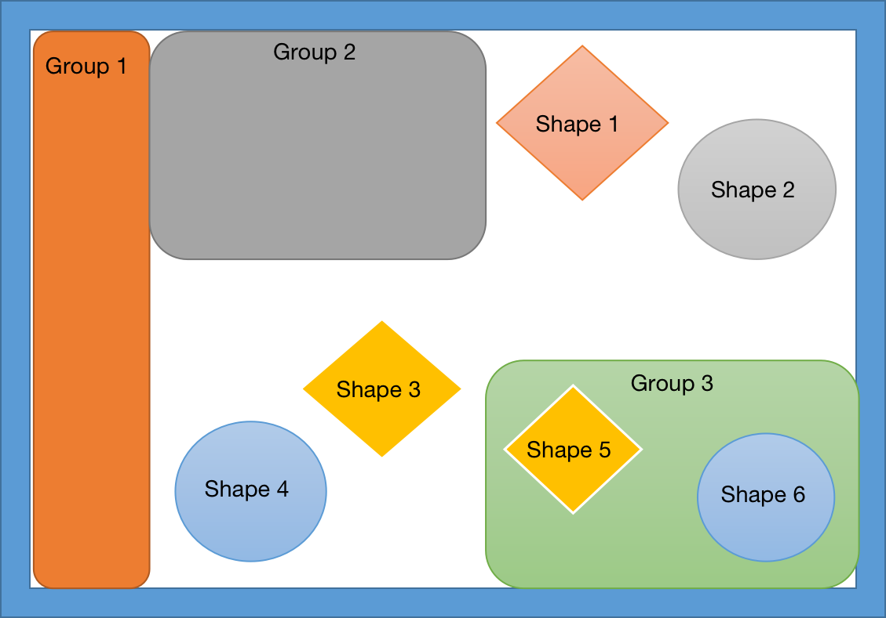

#  🧩  Composite Design Pattern
## Introduction
The composite pattern is a structural design approach enabling the composition of objects into tree-like structures. Subsequently, it allows seamless interaction with these structures as if they were singular entities.
## 🚨 The Problem
Let's consider a graphic design application that deals with various graphical elements such as shapes and groups. In this scenario, the Composite pattern can be beneficial.

Suppose you have two types of objects: Shapes (e.g., circles, rectangles) and Groups. A Group can contain multiple Shapes and even other Groups, forming a hierarchical structure.

Now, imagine you want to implement a feature that allows users to perform operations, like resizing or applying transformations, on selected elements. Without the Composite pattern, you might need to handle Shapes and Groups differently, making the code complex and less flexible.

With the Composite pattern, you can treat Shapes and Groups uniformly as components of a composite structure. This allows you to apply operations recursively to the entire structure without the need for special cases for individual elements. For example, resizing a Group would automatically resize all the Shapes and nested Groups it contains.

Without the Composite pattern, managing such a hierarchical structure could lead to code duplication and increased complexity, especially as the application evolves and new types of elements are introduced. The Composite pattern simplifies the design by providing a consistent interface for both individual elements and their compositions, making it easier to implement and maintain the code for various graphic design operations.

## ✔️ The Solution

The Composite pattern suggests that you work with Graphic Elements, including Shapes and Groups, through a common interface which declares a method for applying operations.

How would this method work? For a Shape, it'd perform the operation directly on the shape itself. For a Group, it'd iterate over each item the group contains, apply the operation to each one, and then return a result for the entire group. If one of these items were another Group, that group would also start applying the operation to its contents and so on, until the operation is applied to all inner components. A Group could even aggregate some additional result, such as combining the transformations of its nested elements.

The greatest benefit of this approach is that you don’t need to care about the concrete classes of objects that compose the hierarchy. You don’t need to know whether an object is a simple Shape or a complex Group. You can treat them all the same via the common interface. When you call a method, the objects themselves pass the request down the hierarchy.

## 🚧 Structural Elements
1. **Component**: The Component interface outlines operations that are shared among both straightforward and intricate elements within the hierarchical structure.
2. **Leaf**: The Leaf class represents the most basic element within the hierarchy. It doesn't contain any child elements.
3. **Composite**: The Composite class represents a complex element within the hierarchy. It can contain child elements, including other composites and leaves.
4. **Client**: The Client class is responsible for interacting with the elements within the hierarchy. It can treat both simple and complex elements uniformly via the component interface.

## 📚🔨 Implementation Guide
1. **Model Representation:**
Ensure your app's core model adopts a tree structure. Break it down into simple elements and containers. Remember, containers should be capable of holding both simple elements and other containers.

2. **Component Interface Declaration:**
Declare the component interface, listing methods that make sense for both simple and complex components.

3. **Leaf Class Creation:**
Establish a leaf class to represent simple elements. Your program may include multiple distinct leaf classes.

4. **Container Class Creation:**
Develop a container class for complex elements. Include an array field for storing references to sub-elements, accommodating both leaves and containers. Ensure the array is declared with the component interface type.

5. **Delegation in Container Class:**
While implementing component interface methods, remember that containers should delegate most of the work to their sub-elements.

6. **Child Element Management:**
Define methods for adding and removing child elements in the container. Note that these operations can be declared in the component interface, although this might conflict with the Interface Segregation Principle. Despite this, treating all elements equally is crucial for seamless tree composition by the client.
## 💡 Implementation Tips
**Builder for Complex Composite Trees:**
The Builder pattern finds utility in creating intricate Composite trees. Its construction steps can be programmed to function recursively, facilitating the assembly of complex structures.

**Chain of Responsibility and Composite Collaboration:**
Chain of Responsibility is commonly employed alongside Composite. When a leaf component receives a request, it can pass it through the chain of parent components, traversing from the leaf to the root of the object tree.

**Iterators for Composite Tree Traversal:**
Iterators prove valuable for traversing Composite trees, providing an efficient means to navigate through the various elements.

**Visitor for Operations Across Composite Trees:**
The Visitor pattern is apt for executing operations across entire Composite trees, allowing for systematic processing of each element.

**Flyweights for Shared Leaf Nodes:**
Implementing shared leaf nodes as Flyweights in the Composite tree can conserve RAM resources, offering an efficient solution.

**Composite and Decorator Structural Similarities:**
Composite and Decorator share similar structure diagrams, relying on recursive composition for organizing an open-ended number of objects.

**Decorator vs. Composite Distinctions:**
While a Decorator resembles a Composite with a single child component, a key difference lies in their purposes. Decorator adds additional responsibilities to the wrapped object, whereas Composite aggregates its children's results.

**Cooperation of Decorator and Composite:**
Both patterns can collaborate effectively; for instance, you can use Decorator to extend the behavior of a specific object within the Composite tree.

**Prototype for Composite and Decorator Designs:**
Designs heavily leveraging Composite and Decorator patterns can benefit from incorporating Prototype. This allows the cloning of complex structures, offering a more efficient alternative to reconstructing them from scratch.