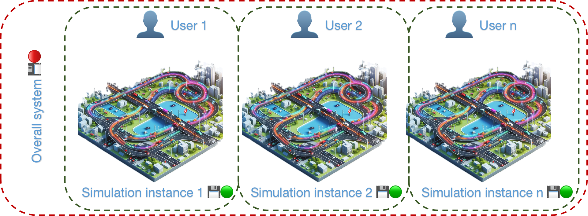

# 🪶 Flyweight Pattern

The Flyweight pattern is a structural design approach that increases the number of objects that can be accommodated
within the available RAM by sharing common state components among multiple objects, rather than storing all data within
each individual object.

## Introduction

The Flyweight design pattern is a crucial structural pattern in software engineering, particularly useful in scenarios
where a system needs to handle a large number of objects efficiently. By focusing on reducing the memory usage through
sharing common parts of the object state, it allows systems to support vast quantities without corresponding increases
in memory load.

This pattern is named after the boxing weight class that includes fighters who are extremely light, indicating the low
memory footprint of the objects. It achieves its efficiency by separating the intrinsic state (the unchanging part) from
the extrinsic state (the changing part) of the objects. This approach allows multiple objects to reference common
intrinsic data, significantly decreasing the overall system memory requirements and improving application scalability
and performance.

## 🚨 The Problem

Imagine you're developing a large-scale simulation for urban planning, where you aim to model and visualize the traffic
flow of an entire city. In this simulation, each car, pedestrian, and bicycle is represented as an individual object
that moves across a complex map of streets and intersections, simulating real-world traffic scenarios.

After extensive development, you deployed the simulation to a public server for government planners and urban developers
to use as a tool for assessing traffic patterns and infrastructure needs. Initially, on your high-end development
machine, the simulation ran smoothly and provided detailed insights. However, when accessed by users with less powerful
systems, the simulation significantly slowed down, and some users even reported that it froze entirely after just a few
minutes of interaction.

Upon reviewing the system logs and user feedback, you realized that the issue stemmed from the high memory consumption
of the simulation. Each vehicle and pedestrian in the simulation was fully instantiated as an object with its unique set
of properties, overwhelming the available RAM on standard machines when the model reached a realistic number of active
elements.

This scenario clearly demonstrates a case where the Flyweight design pattern could be extremely beneficial. By applying
this pattern, the simulation could manage a shared set of common properties (like model type or behavioral rules) while
only individualizing necessary data (like current position or destination) for each entity. This would drastically
reduce the memory footprint and allow the simulation to scale up to realistically model city-wide traffic without
compromising performance on standard hardware.

## ✔️ The Solution

The Flyweight pattern is designed to minimize memory usage by sharing as much data as possible between similar objects.
This pattern can be especially beneficial in your simulation by distinguishing between intrinsic and extrinsic
properties:

Intrinsic Properties: These are shared properties that remain constant across multiple objects. For instance, model
type (e.g., car, pedestrian, bicycle), visual appearance, and behavioral rules (e.g., traffic rules compliance, speed
limits) can be shared among many instances of the same type of entity.

Extrinsic Properties: These are unique properties that vary between objects. Examples include the current position,
destination, and specific state (e.g., whether a car's turn signal is on). These properties need to be maintained
separately for each instance.

To optimize your large-scale urban planning simulation using the Flyweight pattern, follow these steps:

**Step 1**: Identify Shared and Unique Properties
Intrinsic Properties: Determine which properties can be shared among multiple objects. For your simulation, this could
include model type (car, pedestrian, bicycle), visual appearance, and behavioral rules (e.g., traffic rules, speed
limits).
Extrinsic Properties: Identify properties that are unique to each object, such as the current position, destination, and
dynamic state (e.g., a car's turn signal status).

**Step 2**:  Design Flyweight Classes
Create classes that encapsulate the shared intrinsic properties. These classes will serve as the flyweights in your
simulation.
For example, a VehicleFlyweight class would store the common data for all vehicles of a particular type.

**Step 3**: Implement a Flyweight Factory
Develop a factory that manages and provides instances of flyweight objects. The factory should ensure that shared
properties are reused and not duplicated.
The factory should include a method to check if a flyweight object for a specific model type already exists. If it does,
return the existing object; otherwise, create a new one.

**Step 4**: Modify Entity Classes
Update your entity classes (e.g., Vehicle, Pedestrian, Bicycle) to use flyweight objects for shared properties. These
classes should maintain only the unique extrinsic properties.
Each entity object should hold a reference to a flyweight object for its shared data and have its own fields for unique
data like position and destination.

**Step 5**: Adjust the Simulation Code
Modify the part of your simulation that creates new entities to use the FlyweightFactory. Ensure that each new entity
object is associated with the appropriate flyweight object based on its model type.
When creating a new vehicle, for instance, use the factory to obtain the flyweight object that corresponds to the
vehicle's model type.

**Step 6**: Optimize Rendering and Behavior
Ensure that the rendering and behavior methods of your entities make use of the shared data in the flyweight objects.
When rendering an entity, use the visual appearance stored in the flyweight.
When updating the entity’s behavior, refer to the behavioral rules in the flyweight.

## 🚧 Structural Elements

**Flyweight Interface**: defines the methods that the Flyweight objects should implement. These methods can be used to
get and manipulate the intrinsic state of the Flyweight objects.

**Concrete Flyweight**: a class that implements the Flyweight Interface and is capable of storing intrinsic state.
Intrinsic state is the data that is shared across many objects and doesn't change, regardless of the context. Each
unique state is represented by a different Concrete Flyweight object.

**Flyweight Factory**: is responsible for creating and managing the Flyweight objects. The Factory ensures that the same
Concrete Flyweight is not created more than once. When a client requests a Flyweight, the Factory first checks if a
Flyweight matching the given key already exists. If it does, the Factory returns the existing Flyweight. If not, it
creates a new Flyweight, stores it, and then returns it.

**Client**: is the part of the code that uses the Flyweight objects. The client maintains the extrinsic state and calls
methods on the Flyweight objects, passing in the extrinsic state when necessary. The client also interacts with the
Flyweight Factory to retrieve Flyweight objects.

## 📚🔨 Implementation Guide

To implement the Flyweight pattern, follow these steps to optimize your class structure:

1. Divide Fields into Two Parts:

**Intrinsic State:** Identify the fields containing unchanging data that is duplicated across many objects.
**Extrinsic State:** Identify the fields containing contextual data unique to each object.

2. Modify the Class:

Retain the fields representing the intrinsic state within the class, ensuring they are immutable. Initialize these
fields only within the constructor.

3. Refactor Methods:

Review methods that utilize the extrinsic state fields. For each such field, introduce a new parameter in the method
signature and use this parameter instead of the field.

4. Optional: Create a Factory Class:

Develop a factory class to manage the pool of flyweights. This factory should check for an existing flyweight before
creating a new one.
Clients should request flyweights exclusively through this factory, providing the intrinsic state to identify the
desired flyweight.

5. Client-Side Management:

Clients must store or calculate the extrinsic state values to call methods on flyweight objects. For convenience,
consider moving the extrinsic state and the flyweight reference into a separate context class.

## 💡 Implementation Tips

Use the Flyweight pattern when your program must support a vast number of objects that barely fit into the available
RAM. This pattern is especially beneficial in scenarios where:

An application needs to create a large number of similar objects.
This creation process exhausts the available RAM on a target device.
The objects contain duplicate states that can be extracted and shared.
